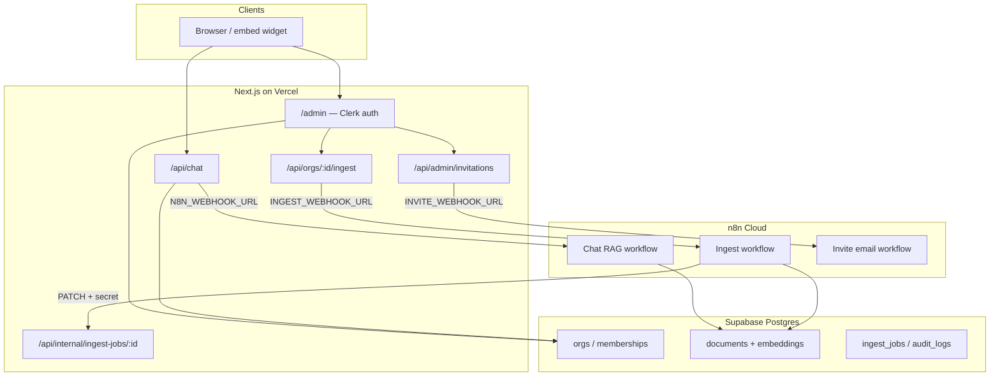
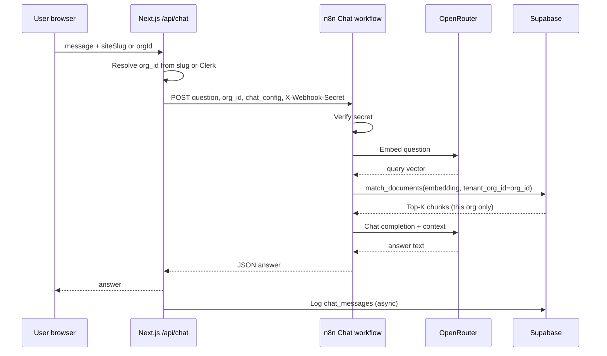
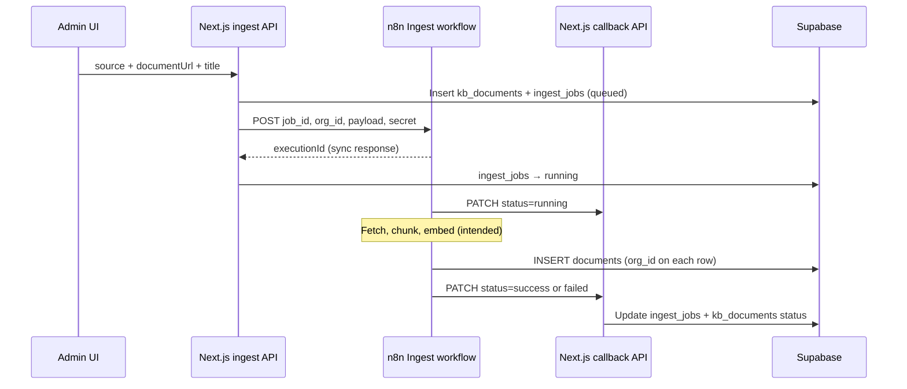
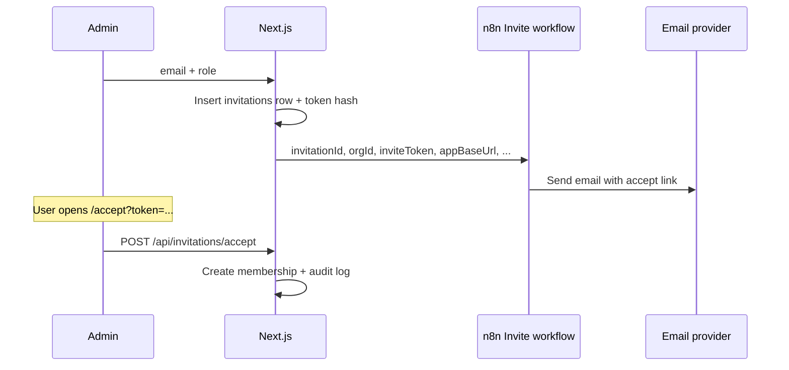

# Multi-Tenant Support SaaS — Complete Presentation Guide

**Product:** AI customer-support chat per organization, with isolated knowledge bases  
**Live app:** https://multi-tenant-support-saas.vercel.app  
**Audience:** Class demo, client walkthrough, or technical review  
**Duration:** 7–12 minutes (short) · 20–25 minutes (with n8n deep dive)

Use this document as your **slide outline + speaker script**. In the app, open **Admin → Present** for clickable demo links scoped to the selected org.

---

## Slide 1 — Title (30 seconds)

**On screen:** Product name, your name, live URL.

**Say:**

> This is a **multi-tenant SaaS** for AI-powered customer support. Each company gets its own workspace, knowledge base, branded public chat URL, and embeddable widget. Answers come from **their** documents only—not from a shared global pool.
>
> The app is Next.js on Vercel; intelligence runs in **n8n** workflows talking to **Supabase** (Postgres + pgvector).

---

## Slide 2 — The problem (45 seconds)

**Say:**

> Traditional chatbots are often **single-tenant**: one KB, one brand. Real B2B SaaS needs:
>
> - **Tenant isolation** — Org A must never see Org B’s vectors  
> - **Self-service ops** — owners invite teammates and upload knowledge without engineering  
> - **Observable pipelines** — ingest success/failure visible in admin  
> - **Composable AI** — swap models and prompts without redeploying the whole app  
>
> We solve that with a thin **product layer** (auth, RBAC, UI) and a thick **automation layer** (n8n).

---

## Slide 3 — High-level architecture (1 minute)



**Say:**

> The browser never talks to OpenRouter or Supabase directly for RAG. **Next.js** authenticates users, resolves **which org** the request belongs to, then calls **n8n webhooks**. n8n embeds text, queries vectors, calls the LLM, and writes chunks back to Postgres.
>
> That split lets non-developers change prompts and workflows in n8n while the app stays a stable API surface.

---

## Slide 4 — Technology stack (45 seconds)

| Layer | Technology | Role |
|--------|------------|------|
| Frontend | Next.js 16, React, Tailwind | Marketing site, admin console, public `/site/[slug]` chat |
| Auth | Clerk | Sign-in, org members, session on `/admin` |
| App DB | Supabase Postgres (`postgres.js`) | Tenants, RBAC, jobs, audit, chat logs |
| Vectors | pgvector + `match_documents(org_id)` | Per-tenant semantic search |
| AI orchestration | **n8n** (cloud) | RAG chat, ingest, invite emails |
| Models | OpenRouter (via n8n HTTP nodes) | `gpt-4.1-mini` chat, `text-embedding-3-small` embeddings |
| Hosting | Vercel | Production deploy |

---

## Slide 5 — Multi-tenancy model (1 minute)

**Concepts:**

| Concept | Where it lives | Example |
|---------|----------------|---------|
| Organization | `public.orgs` | Demo organization, Art craft |
| Public URL | `orgs.site_slug` | `/site/demo-company`, `/site/art-craft-87b0` |
| Membership + role | `public.memberships` | `org_owner`, `content_manager`, … |
| Vector chunks | `public.documents` | Every row has **`org_id`** |
| Retrieval | RPC `match_documents(..., tenant_org_id)` | Fails closed if `tenant_org_id` is null |

**Say:**

> Isolation is enforced in **three places**: the app sends `org_id` to n8n; n8n passes `tenant_org_id` into the RPC; the database function only returns rows matching that UUID. Org A’s embedding for “shipping policy” cannot surface in Org B’s chat.

**Demo proof (important):**

1. Open `/site/demo-company` → ask a **NovaMart** question (e.g. free shipping threshold).  
2. Open `/site/art-craft-87b0` → ask the **same wording** about **workshops** or **Helsinki**.  
3. Answers differ → tenant isolation works.

---

## Slide 6 — Admin console tour (1.5 minutes)

**Live path:** Sign in → sidebar → switch **Workspace** (org dropdown).

| Section | What to show | Message |
|---------|----------------|---------|
| **Home** | Checklist, KPIs | Onboarding state per org |
| **Present** | This script + links | Demo mode |
| **Members** | Invite user, roles | RBAC + invitation flow |
| **Knowledge** | KB status, files, ingest form | Pipeline health + chunk counts |
| **Analytics** | Chat volume, fallback rate | Every turn logged |
| **Audit** | Invites, ingest started | Compliance trail |
| **Settings** | Brand, slug, chat persona | White-label per tenant |
| **Organizations** | Create org | True multi-tenant signup path |

**Say:**

> The admin UI is the **control plane**. The **data plane** for AI is n8n + Postgres. Operators never need n8n login for day-to-day work—except when we change workflows.

---

## Slide 7 — Public product (1 minute)

| Surface | URL pattern | Auth |
|---------|-------------|------|
| Branded chat page | `/site/[site-slug]` | None (slug → `org_id`) |
| Embed widget | `/embed/[slug]` + `embed.js` | None |
| Marketing + widget | `/` | Optional Clerk |

**Say:**

> Visitors get a **branded** chat. The app resolves `site_slug` to `org_id` and sends that to n8n so retrieval is scoped. Rate limiting applies per IP (and per user when signed in).

---

# Part B — How n8n works here (deep dive)

This is the section to emphasize for technical audiences.

## Slide 8 — Why n8n? (45 seconds)

**Say:**

> We use n8n as a **workflow engine** for anything that chains APIs: embed → search → LLM → respond, or fetch document → chunk → embed → insert.
>
> **Benefits:**
> - Visual debugging of each step  
> - Swap OpenRouter models without redeploying Next.js  
> - Retry/error branches per node  
> - Separate webhooks per concern (chat vs ingest vs email)  
>
> **Trade-off:** We must keep webhook secrets and payloads in sync with the app (documented in `docs/WEBHOOK_SECURITY_ROTATION.md`).

**n8n instance (this project):**

| Webhook env var (Vercel) | Typical path | Purpose |
|--------------------------|--------------|---------|
| `N8N_WEBHOOK_URL` | `.../webhook/company-chat` | RAG answers |
| `INGEST_WEBHOOK_URL` | `.../webhook/company-ingest` | KB ingest jobs |
| `INVITE_WEBHOOK_URL` | `.../webhook/company-invite` | Invitation emails (optional) |

All can send header: **`X-Webhook-Secret`** = `WEBHOOK_SECRET` (same value in n8n “IF secret valid” nodes).

---

## Slide 9 — n8n workflow 1: Chat RAG (2 minutes)

**Trigger:** Next.js `POST /api/chat` → `N8N_WEBHOOK_URL`



**Inbound JSON (from app):**

```json
{
  "question": "What workshops do you offer?",
  "company_name": "NovaCompany",
  "org_id": "876b7601-e7d8-40cb-a314-ada04ac3d710",
  "org_name": "Art craft",
  "correlation_id": "uuid",
  "chat_config": {
    "assistant_name": "...",
    "persona": "...",
    "fallback_message": "...",
    "language_policy": "...",
    "show_citations": true
  }
}
```

**Outbound JSON (to app):**

```json
{ "answer": "..." }
```

**Key n8n nodes (typical build):**

1. **Webhook** — receive POST  
2. **IF** — `x-webhook-secret` equals shared secret  
3. **Set** — extract `question`, `org_id`, `chat_config`  
4. **IF** — tenant guard: `org_id` must be non-empty (fail closed)  
5. **HTTP Request** — OpenRouter embeddings (`text-embedding-3-small`)  
6. **HTTP Request** — Supabase RPC `match_documents` with **`tenant_org_id`** = `org_id`  
7. **HTTP Request** — OpenRouter chat (`gpt-4.1-mini`) with retrieved context  
8. **Respond to Webhook** — return `{ "answer": "..." }`

**Say:**

> The critical security property is step 6: **`tenant_org_id` must be the org from the request**, not a hardcoded demo org. We removed legacy `match_documents` overloads that ignored tenant scope (migration `0006`).

---

## Slide 10 — n8n workflow 2: Knowledge ingest (2 minutes)

**Trigger:** Admin **Start ingest** → `POST /api/orgs/:orgId/ingest` → `INGEST_WEBHOOK_URL`



**Inbound JSON:**

```json
{
  "job_id": "uuid",
  "org_id": "uuid",
  "kb_document_id": "uuid",
  "source": "web-url",
  "payload": {
    "title": "Art Craft Knowledge Base",
    "documentUrl": "https://multi-tenant-support-saas.vercel.app/kb/art-craft-87b0/art-craft-knowledge-base.md"
  },
  "correlation_id": "uuid",
  "requested_by": "clerk-user-id"
}
```

**Callback (n8n → app):**

```
PATCH https://multi-tenant-support-saas.vercel.app/api/internal/ingest-jobs/{job_id}
Header: X-Webhook-Secret: <same as Vercel WEBHOOK_SECRET>
Body: { "status": "success" | "failed" | "running", "error": "...", "n8nExecutionId": "..." }
```

**Two ingest paths in the deployed n8n workflow:**

| Path | How it works today |
|------|---------------------|
| **Google Drive trigger** | Download → extract text → chunk (1000 chars, 150 overlap) → OpenRouter embed → Supabase insert. **Must set `org_id` on each row** in Supabase node. |
| **Webhook `company-ingest`** | Validates secret → updates job status via PATCH. **URL fetch + embed branch should be added** for Admin “web-url” ingest; until then use CLI below. |

**Honest talking point:**

> Admin ingest can show **success** while chunk count stays **0** if the webhook only updates status. We ingested Art craft via `npm run ingest:kb-url` (script in repo) and Google Drive / PDF path for NovaMart demo. Production next step: wire HTTP GET `documentUrl` in n8n before the chunk nodes.

**CLI fallback (operators):**

```bash
OPENROUTER_API_KEY=... npm run ingest:kb-url -- \
  --slug art-craft-87b0 \
  --url "https://multi-tenant-support-saas.vercel.app/kb/art-craft-87b0/art-craft-knowledge-base.md" \
  --title "Art Craft Knowledge Base"
```

---

## Slide 11 — n8n workflow 3: Member invite (1 minute)

**Trigger:** Admin invites member → `POST /api/admin/invitations` → optional `INVITE_WEBHOOK_URL`



**Say:**

> Invites are **app-owned** (token in Postgres); n8n is only the **email delivery** automation. If `INVITE_WEBHOOK_URL` is unset, invites still work but no email is sent.

**Common fix you already did:** `Set Invite Data` must map `invitationId` and `orgId` from the webhook body, and `WEBHOOK_SECRET` in n8n must match Vercel.

---

## Slide 12 — Security between app and n8n (1 minute)

| Control | Implementation |
|---------|----------------|
| Webhook authentication | Shared `WEBHOOK_SECRET` header on every n8n call |
| Callback authentication | Same secret on `PATCH /api/internal/ingest-jobs/:id` |
| Tenant isolation | `org_id` / `tenant_org_id` on all retrieval and inserts |
| Admin RBAC | `requireRole(orgId, permission)` on APIs |
| Rate limiting | `/api/chat` per IP / per user |
| Optional RLS | Migration `0004` (defense in depth on Postgres) |

**Production hygiene (post-demo):** `docs/N8N_CREDENTIALS_SETUP.md` — move OpenRouter and Supabase keys from workflow JSON into n8n **Credentials**.

---

## Slide 13 — Data model (45 seconds)

**Core tables:**

- `orgs` — tenant, `site_slug`, `settings` (brand + chat config JSON)  
- `users` + `memberships` — Clerk `auth_subject` → role  
- `documents` — `content`, `metadata`, `embedding`, **`org_id`**  
- `ingest_jobs` + `kb_documents` — pipeline tracking  
- `audit_logs` — invites, ingest, settings changes  
- `chat_messages` — analytics (question, answer, fallback flag, latency)

---

## Slide 14 — Live demo script (7 minutes)

| Step | Action | Time |
|------|--------|------|
| 1 | Show **sidebar** admin, switch **Art craft** vs **Demo organization** | 0:30 |
| 2 | **Knowledge** → 6 chunks, Pipeline healthy, one MD file | 1:00 |
| 3 | Open `/site/art-craft-87b0` → “What workshops do you offer?” | 1:30 |
| 4 | Open `/site/demo-company` → NovaMart question (e.g. free shipping) | 1:30 |
| 5 | **Members** → roles; mention invite → n8n email | 1:00 |
| 6 | **Audit** → show `member.invited`, `ingest.started` | 0:45 |
| 7 | **Present** → Other tenants + embed snippet | 0:45 |
| 8 | Optional: n8n editor screenshot — chat path embed → RPC → LLM | 1:00 |

**Closing line:**

> We built a **multi-tenant control plane** in Next.js and a **repeatable AI pipeline** in n8n, with **hard tenant boundaries** in Postgres. Next production step is completing web-url ingest in n8n and credential hardening.

---

## Slide 15 — Roadmap & Q&A (1 minute)

| Done | Next |
|------|------|
| Multi-tenant auth + RBAC | n8n web-url ingest branch |
| Per-org public sites + embed | Credentials in n8n (not plaintext JSON) |
| Tenant-scoped RAG | Sentry (`docs/SENTRY_SETUP.md`) |
| Audit viewer + KB status | Stripe billing (Sprint 5) |
| Two demo KBs (NovaMart + Art craft) | SSO / enterprise (Sprint 6) |

**Anticipated questions:**

| Question | Answer |
|----------|--------|
| Why not embed RAG inside Next.js? | Faster iteration on prompts/models in n8n; smaller app deploys. |
| How do you prevent cross-tenant leaks? | `org_id` on rows + `match_documents(..., tenant_org_id)` + app sends correct `org_id`. |
| What if n8n is down? | Chat returns webhook error; ingest job marks `failed` with message in admin. |
| Can one email join two orgs? | Yes — separate memberships; org switcher in sidebar. |
| Where are API keys? | OpenRouter in n8n (should be Credentials); DB via Supabase service role in n8n. |

---

## Appendix A — Environment variables (presenter cheat sheet)

See `.env.example`. Minimum for production:

- Clerk: `NEXT_PUBLIC_CLERK_PUBLISHABLE_KEY`, `CLERK_SECRET_KEY`  
- DB: `DATABASE_URL`  
- n8n: `N8N_WEBHOOK_URL`, `INGEST_WEBHOOK_URL`, `WEBHOOK_SECRET`, optional `INVITE_WEBHOOK_URL`  
- Branding: `NEXT_PUBLIC_BRAND_NAME`, `APP_BASE_URL`

---

## Appendix B — Demo URLs (copy-paste)

| Org | Public chat | Sample KB ingest URL |
|-----|-------------|----------------------|
| Demo (NovaMart) | https://multi-tenant-support-saas.vercel.app/site/demo-company | https://multi-tenant-support-saas.vercel.app/kb/demo-company/nova-mart-knowledge-base.md |
| Art craft | https://multi-tenant-support-saas.vercel.app/site/art-craft-87b0 | https://multi-tenant-support-saas.vercel.app/kb/art-craft-87b0/art-craft-knowledge-base.md |

**In-app presenter:** `/admin/present?orgId=<uuid>`

---

## Appendix C — Related docs in this repo

| Doc | Topic |
|-----|--------|
| `docs/KB_PER_ORG.md` | Per-org markdown KB files |
| `docs/N8N_CREDENTIALS_SETUP.md` | Hardening n8n secrets |
| `docs/N8N_INGEST_RETRY.md` | Ingest job states |
| `docs/WEBHOOK_SECURITY_ROTATION.md` | Rotating `WEBHOOK_SECRET` |
| `docs/EMBED_WIDGET.md` | Embed integration |
| Program repo `docs/n8n/CHAT_RAG_WORKFLOW.md` | Chat node-by-node |
| Program repo `docs/n8n/INGEST_WORKFLOW.md` | Ingest node-by-node |

---

*Last updated: May 2026 — aligned with production deploy and Art craft + Demo org KBs.*
